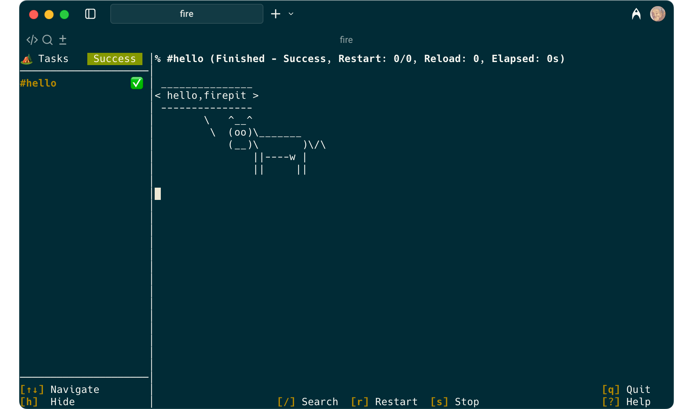
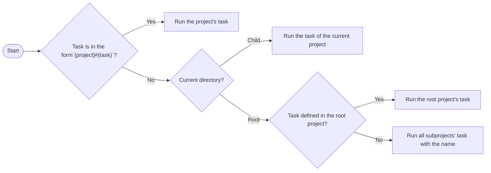
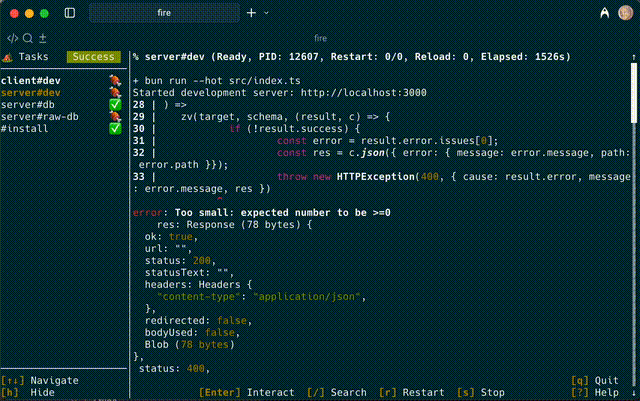
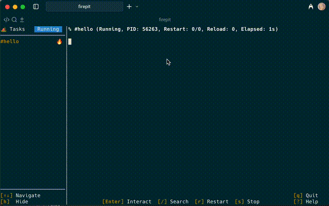

# Firepit

🏕 Simple task & service runner with comfy terminal UI.


- [Features](#features)
- [Installation](#installation)
- [Getting Started](#getting-started)
- [Project Structure](#project-structure)
  - [Single project](#single-project)
  - [Multi project (monorepo)](#multi-project-monorepo)
- [Tasks and Services](#tasks-and-services)
- [Dependencies](#dependencies)
- [Service Readiness](#service-readiness)
- [Variables and Templating](#variables-and-templating)
- [Environments](#environments)
- [Merging Config Files](#merging-config-files)
- [Incremental Build](#incremental-build)
- [Terminal UI](#terminal-ui)
  - [Sidebar](#sidebar)
  - [Main View](#main-view)
  - [Log Search](#log-search)
  - [Interaction](#interaction)

## Features

- Individual task logs
- Interaction with running tasks
- Service management
- Works with single packages and monorepos

## Installation

Firepit is supported on macOS and Linux.

```bash
curl -LsSf https://github.com/kota65535/firepit/releases/latest/download/firepit-installer.sh | sh
```

## Getting Started

Create a `firepit.yml`.

```yaml
tasks:
  # Task name
  hello:
    # The command to execute in shell
    command: npx cowsay "hello,firepit"
```

Run `firepit` in the terminal.

```bash
firepit hello
```



Press `q` key to quit the TUI. The task logs are preserved and also printed to standard output after TUI exits.

```
% #hello (Finished - Success, Restart: 0/0, Reload: 0, Elapsed: 1s)
 _______________
< hello,firepit >
 ---------------
        \   ^__^
         \  (oo)\_______
            (__)\       )\/\
                ||----w |
                ||     ||
```

## Project Structure

Firepit can be used in single packages and monorepos.

### Single project

A single project contains a `firepit.yml` in the root directory.

### Multi project (monorepo)

A multi project contains multiple packages with their own `firepit.yml` files.

```
.
├── firepit.yml
├── client/
│   └── firepit.yml
└── server/
    └── firepit.yml
```

The root `firepit.yml` defines subprojects and common tasks.

```yaml
projects:
  client: packages/client
  server: packages/server

tasks:
  install:
    command: bun install
```

The each `firepit.yml` in subprojects defines its own tasks and services.

- server/firepit.yml

```yaml
tasks:
  dev:
    command: bun run dev
    depends_on:
      - "#install"
    service: true
```

- client/firepit.yml

```yaml
tasks:
  dev:
    command: bun run dev
    depends_on:
      - "#install"
      - server#dev
    service: true
```

Tasks can be referenced across projects using the form `{project}#{task}`.
Note that the root project name is treated as an empty string, so you can reference root tasks with `#{task}`.

For example, to run client's dev task:

```bash
firepit client#dev
```

Move to the client directory and run the dev task directly:

```bash
cd packages/client
firepit dev
```

Run client & server dev tasks (because root project does not have dev task)

```bash
firepit dev
```

This is how Firepit resolves which task to run:



## Tasks and Services

Tasks and services are different in the following ways:

- **Tasks:** Run to completion and exit.
- **Services:** Long-running processes that stay active until stopped.

Services can be defined by setting `service: true` in the task definition.

```yaml
tasks:
  dev:
    command: bun run --hot src/index.ts
    service: true
```

## Dependencies

Tasks can depend on other tasks using the `depends_on` field.
Dependency tasks are executed before the target task.

In this example, `install` and `compile` tasks are executed sequentially before the `build` task.

```yaml
tasks:
  install:
    command: bun install

  compile:
    command: bun build src/index.ts --compile --outfile dist/app
    depends_on:
      - install

  build:
    command: docker build -t single:latest .
    depends_on:
      - compile
```

## Service Readiness

When a service task is added to the dependencies, target task run immediately after the service starts by default.

In this example, the `dev` service may start before the `db` service is ready to accept connections.

```yaml
tasks:
  dev:
    command: bun run --hot src/index.ts
    service: true
    depends_on:
      - install
      - db

  db:
    command: redis-server
    service: true
```

You can configure the `db` service to signal its readiness by using the `healthcheck` field.
There are two ways to define a healthcheck:

- **Command:** Runs a command periodically until it exits with a zero status.
- **Log:** Waits until log message appears that matches the given regex.

Most services become _Ready_ when they start listening on a port, so you can easily check this with the netcat (`nc`) command.
By default, healthcheck command is run every 5 seconds, with a timeout of 5 seconds, and up to 3 retries.

```yaml
db:
  command: redis-server
  service:
    healthcheck:
      command: nc -z localhost 6379
      # Default values
      start_period: 0
      interval: 5
      timeout: 5
      retries: 3
```

Sometimes it is sufficient to wait for a specific log output.
In such cases, you can configure the service to be considered _Ready_ when a log message like `Ready to accept connections tcp` appears.

```yaml
db:
  command: redis-server
  service:
    healthcheck:
      log: Ready to accept connections tcp
```

## Variables and Templating

You can define template variables using the `vars` field.

```yaml
# Project level variables
vars:
  aws_account_id: 123456789012
  aws_region: ap-northeast-1
  ecr_registry: "{{ aws_account_id }}.dkr.ecr.{{ aws_region }}.amazonaws.com"

tasks:
  build:
    # Task level variables
    vars:
      app_name: single
      ecr_repository: "{{ ecr_registry }}/{{ app_name }}"
    command: docker build -t {{ ecr_repository }}:latest .
```

Firepit performs template processing using [Tera](https://keats.github.io/tera/).
Check the documentation for details about the template syntax.

Template processing is supported in the following fields:

- `vars`
- `label`
- `command`
- `env`
- `env_files`
- `working_dir`
- `depends_on`

There are also some built-in variables available for use in templates.

| Name           | Type                | Description                                                            |
| -------------- | ------------------- | ---------------------------------------------------------------------- |
| `root_dir`     | &str                | The absolute path of the root project dir. Multi-projects only.        |
| `project_dirs` | HashMap<&str, &str> | Map of all project names to their absolute paths. Multi-projects only. |
| `project_dir`  | &str                | The absolute path of the current project directory.                    |
| `project`      | &str                | The project name. Multi-projects only.                                 |
| `task`         | &str                | The task name.                                                         |

## Environments

You can define environment variables for tasks and services using the `env` field.
Dotenv files can be also loaded using the `env_files` field.
Note that environment variables are not inherited by dependency tasks.

```yaml
# Project level environment variables
env:
  TZ: Asia/Tokyo

# Project level dotenv files
env_files:
  - .env

tasks:
  dev:
    command: bun run --hot src/index.ts
    # Task level environment variables
    env:
      PORT: 3000
      REDIS_URL: redis://localhost:6379
    # Task level dotenv files
    env_files:
      - .env.dev
    depends_on:
      - install
      - db
    service:
      healthcheck:
        command: nc -z localhost 3000
        interval: 2
```

## Merging Config Files

You can merge multiple configuration files using `includes` field.
Starting from an empty YAML, files specified in `includes` are merged in order, followed by the original `firepit.yml`.

If the field name conflicts, merging strategy depends on the field type.

- number, string, boolean: the later one takes precedence.
- list: the later one is appended to the former one.
- map: merged recursively.

Assume we have the following files:

- common-vars.yml

```yaml
vars:
  aws_account_id: 123456789012
  aws_region: ap-northeast-1
```

- common-tasks.yml

```yaml
tasks:
  install:
    command: bun install
```

- firepit.yml

```yaml
includes:
  - common-vars.yml
  - common-tasks.yml

vars:
  ecr_registry: "{{ aws_account_id }}.dkr.ecr.{{ aws_region }}"

tasks:
  dev:
    command: bun run --hot src/index.ts
    depends_on:
      - install
```

Then, the merged configuration is equivalent to:

```yaml
vars:
  aws_account_id: 123456789012
  aws_region: ap-northeast-1
  ecr_registry: "{{ aws_account_id }}.dkr.ecr.{{ aws_region }}"

tasks:
  install:
    command: bun install

  dev:
    command: bun run --hot src/index.ts
    depends_on:
      - install
```

## Incremental Build

Firepit can skip tasks if there have been no changes since the last successful run that would produce different outputs.
This is called incremental build.

To enable incremental build, specify the `inputs` and `outputs` fields for each task.
You can use glob patterns to specify multiple files. Check the [globset documentation](https://docs.rs/globset/latest/globset/) for the supported syntax.

```yaml
tasks:
  compile:
    command: bun build src/index.ts --compile --outfile dist/app
    inputs:
      - src/**
    outputs:
      - dist/app
    depends_on:
      - install
```

The task will be skipped if the following conditions are met:

- There is at least one file matching the patterns specified in the `inputs` and `outputs` fields
- All files listed in `inputs` are older than the files listed in `outputs`.

## Terminal UI

Firepit provides a terminal user interface (TUI) to monitor and interact with running tasks and services.


TUI is available if tty is detected (In most cases, when you run Firepit in a terminal).
If tty is not detected (such as CI environments), Firepit runs tasks with CUI mode and outputs logs to standard output.

### Sidebar

The sidebar on the left displays a list of running tasks and their statuses.
The highlighted task is the currently selected task whose logs are shown in the main view.
Task statuses are indicated by the following icons:

| Icon | Name       | Detail                                                  |
| ---- | ---------- | ------------------------------------------------------- |
| 🪵   | Planned    | The task is waiting for running                         |
| 🔥   | Running    | The task is currently executing                         |
| ✅   | Success    | The task has completed successfully                     |
| 🍖   | Ready      | The service task is ready to use                        |
| 🥬   | Up to date | The task is already up to date and does not need to run |
| ❌   | Failure    | The task has completed with an error                    |
| 🚫   | Stopped    | The task has been manually stopped                      |
| ⚠️    | Skipped    | The task has been skipped due to failed dependencies    |

### Main View

The main view on the right displays real-time logs of the selected task.
You can scroll through the logs using mouse wheel or keyboard.

### Log Search

To search logs, press `/` to open the search bar. Type the search query and press `Enter`.
The search results are highlighted in the logs, and you can navigate through the results using `n` (next) and `N` (previous) keys.
Press `Esc` to remove the search results.



### Interaction

Some commands require user inputs such as Yes/No. Firepit supports these interactive commands.
You can switch to "Interaction mode" and enter the shell of the currently selected task by pressing the `Enter` key.
At this time, keyboard inputs are sent directly to the task's standard input.
To exit interaction mode, press `Ctrl-Z`.


