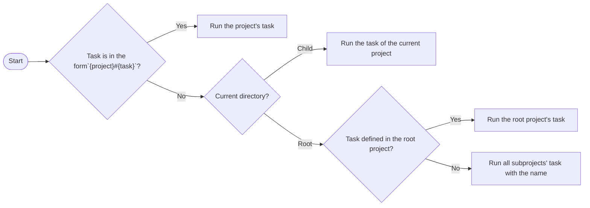

# Configuration

Firepit configuration file is written in YAML format and named `firepit.yml`.
It defines tasks, services, dependencies, environment variables, and other settings for your project.

## Project Structure

Firepit can be used in single packages and monorepos.

### Single project

A single project contains a `firepit.yml` in the root directory.

### Multi project (monorepo)

A multi project contains multiple packages with their own `firepit.yml` files.

```
.
├── firepit.yml
└── packages/
    ├── client/
    │   └── firepit.yml
    └── server/
        └── firepit.yml
```

The root `firepit.yml` defines subprojects and common tasks.

```yaml
projects:
  client: packages/client
  server: packages/server

tasks:
  install:
    command: bun install
```

Each `firepit.yml` in subprojects defines its own tasks.

::: code-group

```yaml [packages/client/firepit.yml]
tasks:
  dev:
    command: bun run dev
    depends_on:
      - "#install"
      - server#dev
    service: true
```

```yaml [packages/server/firepit.yml]
tasks:
  dev:
    command: bun run dev
    depends_on:
      - "#install"
    service: true
```

:::

Tasks can be referenced across projects using the form `{project}#{task}`.
Note that the root project name is treated as an empty string, so you can reference root tasks with `#{task}`.

For example, to run client's dev task:

```bash
fire client#dev
```

Move to the client directory and run the dev task directly:

```bash
cd packages/client
fire dev
```

Run client & server dev tasks (because root project does not have dev task)

```bash
fire dev
```

This is how Firepit resolves which task to run:



## Tasks and Services

Tasks and services are different in the following ways:

- **Tasks:** Run to completion and exit.
- **Services:** Long-running processes that stay active until stopped.

Services can be defined by setting `service: true` in the task definition.

```yaml
tasks:
  dev:
    command: bun run --hot src/index.ts
    service: true
```

## Dependencies

Tasks can depend on other tasks using the `depends_on` field.
Dependency tasks are executed before the target task.

In this example, `install` and `compile` tasks are executed sequentially before the `build` task.

```yaml
tasks:
  install:
    command: bun install

  compile:
    command: bun build src/index.ts --compile --outfile dist/app
    depends_on:
      - install

  build:
    command: docker build -t single:latest .
    depends_on:
      - compile
```

## Service Readiness

When a service task is added to the dependencies, target task run immediately after the service starts by default.

In this example, the `dev` service may start before the `db` service is ready to accept connections.

```yaml
tasks:
  dev:
    command: bun run --hot src/index.ts
    service: true
    depends_on:
      - install
      - db

  db:
    command: redis-server
    service: true
```

You can configure the `db` service to signal its readiness by using the `healthcheck` field.
There are two ways to define a healthcheck:

- **Command:** Runs a command periodically until it exits with a zero status.
- **Log:** Waits until log message appears that matches the given regex.

Most services become _Ready_ when they start listening on a port, so you can easily check this with the `nc` (netcat) command.
By default, healthcheck command is run every 5 seconds, with a timeout of 5 seconds, and up to 3 retries.

```yaml
db:
  command: redis-server
  service:
    healthcheck:
      command: nc -z localhost 6379
      # Default values
      start_period: 0
      interval: 5
      timeout: 5
      retries: 3
```

Sometimes it is sufficient to wait for a specific log output.
In such cases, you can configure the service to be considered _Ready_ when a log message like `Ready to accept connections tcp` appears.

```yaml
db:
  command: redis-server
  service:
    healthcheck:
      log: Ready to accept connections tcp
```

## Template Variables

You can define template variables using the `vars` field.

```yaml
# Project level variables
vars:
  aws_account_id: 123456789012
  aws_region: ap-northeast-1
  ecr_registry: "{{ aws_account_id }}.dkr.ecr.{{ aws_region }}.amazonaws.com"

tasks:
  build:
    # Task level variables
    vars:
      app_name: single
      ecr_repository: "{{ ecr_registry }}/{{ app_name }}"
    command: docker build -t {{ ecr_repository }}:latest .
```

Firepit performs template processing using [Tera](https://keats.github.io/tera/).
Check the documentation for details about the template syntax.

Template processing is supported in the following fields:

- `vars`
- `label`
- `command`
- `env`
- `env_files`
- `working_dir`
- `depends_on`

There are also some built-in variables available for use in templates.

| Name           | Type                | Description                                                            |
| -------------- | ------------------- | ---------------------------------------------------------------------- |
| `root_dir`     | string              | The absolute path of the root project dir. Multi-projects only.        |
| `project_dirs` | Map<string, string> | Map of all project names to their absolute paths. Multi-projects only. |
| `project_dir`  | string              | The absolute path of the current project directory.                    |
| `project`      | string              | The project name. Multi-projects only.                                 |
| `task`         | string              | The task name.                                                         |

## Environment Variables

Environment variables can be defined in the `env` field.
You can also specify [dotenv](https://github.com/motdotla/dotenv) files in the `env_files` field.
The precedence of environment variables is as follows:

1. Environment variables in the `env` field
2. Environment variables from each dotenv file listed in the `env_files` field. Files with earlier order have higher priority.
3. OS environment variables

Note that dependency tasks do not inherit the environment variables of their parent task.

```yaml
# Project level environment variables
env:
  TZ: Asia/Tokyo

# Project level dotenv files
env_files:
  - .env

tasks:
  dev:
    command: bun run --hot src/index.ts
    # Task level environment variables
    env:
      PORT: 3000
      REDIS_URL: redis://localhost:6379
    # Task level dotenv files.
    # .env.local has a higher priority than .env
    env_files:
      - .env.local
      - .env
    depends_on:
      - install
      - db
    service:
      healthcheck:
        command: nc -z localhost 3000
        interval: 2
```

## Merging Config Files

You can merge multiple configuration files using `includes` field.
Starting from an empty YAML, files specified in `includes` are merged in order, followed by the original `firepit.yml`.

If the field name conflicts, merging strategy depends on the field type.

- number, string, boolean: the later one takes precedence.
- list: the later one is appended to the former one.
- map: merged recursively.

Assume we have the following files:

::: code-group

```yaml [common-vars.yml]
vars:
  aws_account_id: 123456789012
  aws_region: ap-northeast-1
```

```yaml [common-tasks.yml]
tasks:
  install:
    command: bun install
```

:::

::: code-group

```yaml [firepit.yml]
includes:
  - common-vars.yml
  - common-tasks.yml

vars:
  ecr_registry: "{{ aws_account_id }}.dkr.ecr.{{ aws_region }}"

tasks:
  dev:
    command: bun run --hot src/index.ts
    depends_on:
      - install
```

:::

Then, the merged configuration is equivalent to:

```yaml
vars:
  aws_account_id: 123456789012
  aws_region: ap-northeast-1
  ecr_registry: "{{ aws_account_id }}.dkr.ecr.{{ aws_region }}"

tasks:
  install:
    command: bun install

  dev:
    command: bun run --hot src/index.ts
    depends_on:
      - install
```

## Incremental Build

Firepit can skip tasks if there have been no changes since the last successful run that would produce different outputs.
This is called incremental build.

To enable incremental build, specify the `inputs` and `outputs` fields for each task.
You can use glob patterns to specify multiple files. Check the [globset documentation](https://docs.rs/globset/latest/globset/) for the supported syntax.

```yaml
tasks:
  compile:
    command: bun build src/index.ts --compile --outfile dist/app
    inputs:
      - src/**
    outputs:
      - dist/app
    depends_on:
      - install
```

The task will be skipped if the following conditions are met:

- There is at least one file matching the patterns specified in the `inputs` and `outputs` fields
- All files listed in `inputs` are older than the files listed in `outputs`.

## Watch Mode

In watch mode, Firepit monitors the files specified in the `inputs` field and automatically re-runs the task and dependents when changes are detected.
To enable watch mode, add `-w` or `--watch` option.

```bash
fire -w build
```
