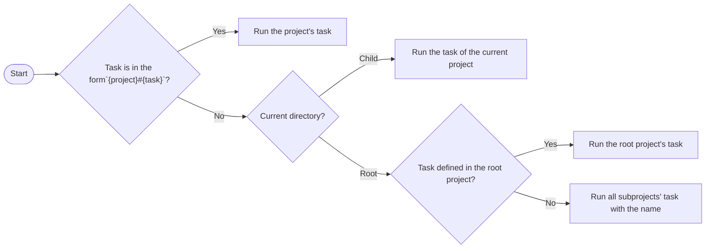

# Configuration

Firepit is configured with a single YAML file named `firepit.yml` (or `firepit.yaml`) in your project directory.
It defines the tasks you can run, along with their dependencies, variables, environment, and other settings.

The smallest possible configuration is a single task:

```yaml
tasks:
  hello:
    command: echo "hello, firepit"
```

Run it by name:

```bash
fire hello
```

The rest of this page builds up from here: defining [tasks](#tasks), parameterizing them with [variables](#variables) and [environment variables](#environment-variables), wiring them together with [dependencies](#dependencies), running long-lived [services](#services), speeding up reruns with [incremental builds and watch mode](#incremental-builds-and-watch-mode), and—for larger setups—[multi-project monorepos](#multi-project-monorepo) and [shared configuration](#reusing-configuration).

## Tasks

A task is a named command. Tasks are defined under the `tasks` key, where each key is the task name.

```yaml
tasks:
  build:
    command: bun build src/index.ts --outfile dist/app
```

By default a command runs in your shell, in the project directory. You can override both:

- **`shell`:** The shell command used to run the command, and its arguments.
- **`working_dir`:** The directory to run the command in, relative to the project directory (or an absolute path).

```yaml
tasks:
  build:
    command: bun build src/index.ts --outfile dist/app
    working_dir: app
    shell:
      command: bash
      args: ["-c"]
```

Tasks run to completion and exit. Long-running processes such as servers are modeled as [services](#services) instead.

### Description and Label

You can annotate a task with a `description` and a `label`.

- **`description`:** A human-readable explanation of what the task does.
  It is shown in the task listing (`fire --list`) and help output. It may span multiple lines.
- **`label`:** A display name used instead of the task name in the TUI/CUI output (for example as the log prefix and pane title).
  When omitted, the task name is used. Unlike `description`, `label` also supports [template variables](#variables) (covered in the next section).

```yaml
tasks:
  dev:
    description: Start the dev server with hot reload
    label: "{{ project }}/dev"
    command: bun run --hot src/index.ts
    service: true
```

## Variables

You can define template variables using the `vars` field, both at the project level and per task.

```yaml
# Project level variables
vars:
  registry: docker.io/example

tasks:
  build:
    # Task level variables
    vars:
      app: server
    command: docker build -t {{ registry }}/{{ app }}:latest .
```

A task level variable shadows the project level variable of the same name.
Variables given by the `Name=Value` CLI argument override both: project level variables, and
task level variables of the tasks you run.

```
fire build              # runs: docker build -t docker.io/example/server:latest .
fire build app=client   # runs: docker build -t docker.io/example/client:latest .
```

Firepit performs template processing using [Tera](https://keats.github.io/tera/).
Check the documentation for details about the template syntax.

Template processing is supported in the following fields:

- `vars`
- `label`
- `command`
- `env`
- `env_files`
- `working_dir`
- `depends_on`
- `wait_for`

There are also some built-in variables available for use in templates.

| Name           | Type                | Description                                                            |
| -------------- | ------------------- | ---------------------------------------------------------------------- |
| `root_dir`     | string              | The absolute path of the root project dir. Multi-projects only.        |
| `project_dirs` | Map<string, string> | Map of all project names to their absolute paths. Multi-projects only. |
| `project_dir`  | string              | The absolute path of the current project directory.                    |
| `project`      | string              | The project name. Multi-projects only.                                 |
| `task`         | string              | The task name.                                                         |
| `watch`        | boolean             | `true` if running in watch mode, `false` otherwise.                    |

### Typed Variables

A variable written as a plain value is a _scalar_: a string, number, boolean, or `null`, with the type inferred from the value.
To declare an array or a map, or to fix the type of a variable, write it in object form with a `type` and an optional `default`.
The types follow JSON Schema: `string`, `number`, `integer`, `boolean`, `array`, and `object`.

```yaml
vars:
  version:
    type: string
    default: "1.10" # stays a string; a scalar `version: 1.10` would be the number 1.1
  replicas:
    type: integer
    default: 1
  files:
    type: array
    default: [src/a.ts, src/b.ts]
  labels:
    type: object
    default:
      team: platform
```

Array and map values are only accepted as the `default` of a typed variable, so that an object is never ambiguous between a value and a declaration.
Omitting `default` makes the variable [required](#required-variables).

A value given from outside the config file—the `Name=Value` CLI argument or a [dependency override](#parameterized-dependencies)—is interpreted according to the declared type.
For a scalar variable the type is inferred from the value (`count=10` is a number, `flag=true` a boolean); for a typed variable the value is parsed as YAML and checked against the type, so a `string` variable keeps `version=1.10` as is, and an `array` variable accepts `files="[a, b]"`.
A value that does not match the declared type is an error.

### Validation

A typed variable accepts any [JSON Schema](https://json-schema.org/draft/2020-12/json-schema-validation) keyword next to `type`, such as `enum`, `pattern`, `minimum`, `maximum`, `minLength`, `items`, or `uniqueItems`.
The value—the `default`, a CLI argument, a dependency override, or a dynamic variable's output—is validated against them before any task runs, and a violation is an error.

```yaml
vars:
  env:
    type: string
    enum: [dev, staging, prod]
    default: dev
  version:
    type: string
    pattern: '^\d+\.\d+\.\d+$'
  port:
    type: integer
    minimum: 1024
    maximum: 65535
    default: 8080
  tags:
    type: array
    items:
      type: string
      pattern: "^[a-z]+$"
    minItems: 1
    default: [web]
```

```
fire deploy env=qa   # error: failed to render var "env": "qa" is not one of ["dev","staging","prod"]
```

The keywords require `type`, since the applicable keywords depend on it.
An unknown keyword is a configuration error, so a typo such as `patern` does not pass silently; annotation keywords such as `title` or `description` are not accepted either.
`pattern` is unanchored, as in JSON Schema: write `^...$` to match the whole value.

### Required Variables

A variable declared without a value has no default, so it is required: give it a value with the
`Name=Value` CLI argument or the dependent task's `depends_on.vars`
(see [Parameterized Dependencies](#parameterized-dependencies)), or running the task is an error.

```yaml
tasks:
  deploy:
    vars:
      version:
      region: us-east-1
    command: ./deploy.sh {{ version }} {{ region }}
```

```
fire deploy                # error: task "#deploy" requires vars that are not set: "version"
fire deploy version=1.2.3  # runs: ./deploy.sh 1.2.3 us-east-1
```

A project level variable declared without a value is required by every task of the project:
running any of them without the `Name=Value` CLI argument is an error.

Only the tasks being run, their dependency tasks, and the projects they belong to are checked.
To declare a variable whose default value is empty, write an empty string (`version: ""`) instead.

The `Name=Value` CLI argument only overrides a declared variable, so a name matching no
declaration is an error. The `deploy` task above declares `version` and `region`, so passing
anything else is rejected instead of being silently ignored:

```
fire deploy version=1.2.3 stage=prod  # error: vars given by the CLI argument are not declared in any project or task: "stage"
```

This also applies to a variable used only inside another variable's template: declare it with a
default value to make it overridable.

```yaml
vars:
  tag: latest
  image: myapp:{{ tag }}
```

### Passing Arguments

The `args` variable is a convenient convention for forwarding command-line arguments to a task.
Declare it with a default value, reference it in the command, and override it from the CLI using `--`:

```yaml
tasks:
  test:
    vars:
      args: ""
    command: cargo test {{ args }}
```

```
fire test -- --nocapture my_test   # runs: cargo test --nocapture my_test
```

Everything after `--` is shell-escaped, joined with a space, and assigned to `args`.
Embed `{{ args }}` without extra quotes so the shell can interpret the generated quoting correctly.
Since `--` is just an alias for `args=...`, specifying both at the same time is an error.

A dependent task can also set `args`—or any variable—on the task it depends on. See [Parameterized Dependencies](#parameterized-dependencies).

### Quoting Values

Values coming from outside the config file—the CLI, a [dynamic variable](#dynamic-variables), or a [dependency override](#parameterized-dependencies)—may contain spaces, quotes or shell metacharacters.
The `quote` filter escapes such a value so that it stays a single argument of the command:

```yaml
tasks:
  greet:
    vars:
      message: ""
    command: echo {{ message | quote }}

  fmt:
    vars:
      files:
        type: array
        default: []
    command: prettier --write {{ files | quote }}
```

```
fire greet 'message=hello; date'              # runs: echo 'hello; date'
fire fmt 'files=["src/a.ts", "my file.ts"]'   # runs: prettier --write src/a.ts 'my file.ts'
```

Without the filter, the `;` would end the `echo` command and `date` would run as a command of its own.
Write `{{ message | quote }}` without adding quotes of your own—the filter emits whatever quoting the value needs.

As the `fmt` task shows, an array is quoted element by element and joined with a space, so a list variable turns into a list of arguments and a path containing a space is not split in two.
Numbers, booleans and `null` are accepted as well; `null` becomes an empty argument.
Maps, nested arrays and values containing a nul byte have no single-argument representation and are reported as an error.

The filter is for `command` fields.
Values of `env` are passed to the process directly without going through a shell, so quoting them would make the quotes part of the value.
The `args` variable does not need it either, since arguments after `--` are already escaped.

### Dynamic Variables

The variables shown so far are _static_: their values are written in the config file.
A variable can instead be _dynamic_, taking its value from the output of a command.
Write the variable in object form and specify a `command`:

```yaml
vars:
  git_sha:
    command: git rev-parse --short HEAD
  build_date:
    command: date +%Y%m%d
    # Optional fields
    working_dir: .
    shell:
      command: bash
      args: ["-c"]

tasks:
  build:
    command: docker build -t app:{{ git_sha }} .
```

The command's standard output, trimmed of surrounding whitespace, becomes the variable's value; standard error is ignored.
In addition to `command`, a dynamic variable accepts the optional `shell`, `working_dir`, `env`, `env_files`, and `cache` fields.

#### Reusing a Command Output

A dynamic variable runs its command once for every project and task that declares it.
A variable defined in a file that many projects include therefore runs its command once per project, which gets slow when the command is expensive.

Set `cache: true` to run the command only once and reuse its output for the rest:

```yaml
# common.yml, included by every project
vars:
  branch:
    command: git rev-parse --abbrev-ref HEAD
    working_dir: "{{ root_dir }}"
    cache: true
```

Variables share an output when everything the command runs with matches: the `command` itself, the `shell`, the resulting environment, and the working directory.
`env_files` are compared by the values they define rather than by their paths, so each project reading its own dotenv file still shares an output as long as the values agree.

The `working_dir` above is what makes the output shared.
The branch is a property of the repository rather than of each project, so pinning the command to the root gives every declaration the same directory, and one run answers for all of them.
Without it each project runs the command in its own directory and nothing is reused; Firepit warns when a `cache: true` variable runs more than once for that reason.

A command whose output does depend on where it runs, such as `pwd` or one reading a relative path, keeps the project's own directory and its own value, so leave `cache` off for it.
Leave it off as well for a command that must run every time, such as one allocating a resource.

The output is reused within a single run of the config only.
In watch mode, every reload runs the commands again.

By default the type of the value is inferred from the output, like a scalar variable.
Give the dynamic variable a `type` to interpret the output as a [typed variable](#typed-variables) instead: `string` keeps the output as is, and `array` or `object` parse the output as YAML, so a command can produce a list or a map.

```yaml
vars:
  branch:
    type: string # "1e10" stays a string
    command: git rev-parse --abbrev-ref HEAD
  packages:
    type: array
    command: ls -d packages/*/ | jq -R . | jq -sc .
```

## Environment Variables

Environment variables can be defined in the `env` field.
You can also specify [dotenv](https://github.com/motdotla/dotenv) files in the `env_files` field.
The precedence of environment variables is as follows:

1. Environment variables in the `env` field
2. Environment variables from each dotenv file listed in the `env_files` field.
   If the same environment variable is defined in multiple files, the later file takes precedence.
3. OS environment variables

Note that dependency tasks do not inherit the environment variables of their parent task.

```yaml
# Project level environment variables
env:
  TZ: Asia/Tokyo

# Project level dotenv files
env_files:
  - .env

tasks:
  dev:
    command: bun run --hot src/index.ts
    # Task level environment variables
    env:
      PORT: 3000
      REDIS_URL: redis://localhost:6379
    # Task level dotenv files.
    # .env.local has a higher priority than .env
    env_files:
      - .env.local
      - .env
```

## Dependencies

Tasks can depend on other tasks using the `depends_on` field.
Dependency tasks are executed before the target task.

In this example, `install` and `compile` tasks are executed sequentially before the `build` task.

```yaml
tasks:
  install:
    command: bun install

  compile:
    command: bun build src/index.ts --compile --outfile dist/app
    depends_on:
      - install

  build:
    command: docker build -t single:latest .
    depends_on:
      - compile
```

### Finalizers

The `finalized_by` field is the opposite of `depends_on`: the listed tasks are executed **after** the task finishes, whether it succeeds or fails.
This makes it suitable for cleanup tasks that must always run.
For a [service](#services), the finalizers run when it exits, not when it becomes ready, so they can tear down what the service left behind once it is stopped.
Finalizers are only added to the run when the task they finalize is part of it, so running a finalizer alone does not run that task.

In this example, `fire test` starts the `db` service, runs `test`, and runs `db-down` once `db` is stopped, whether `test` passed or not.
`fire db-down` runs only `db-down`.

```yaml
tasks:
  db:
    command: docker compose up db
    service:
      healthcheck:
        command: docker compose exec db pg_isready
    finalized_by:
      - db-down

  test:
    command: cargo test
    depends_on:
      - db

  db-down:
    command: docker compose down
```

As with [parameterized dependencies](#parameterized-dependencies), writing a finalizer in object form overrides its `vars`, and each set of `vars` runs its own variant of the finalizer.

```yaml
tasks:
  build:
    command: bun run build
    finalized_by:
      - task: notify
        vars:
          channel: builds # runs: ./notify.sh builds

  notify:
    vars:
      channel:
    command: ./notify.sh {{ channel }}
```

### Parameterized Dependencies

Writing a dependency in object form lets you override its `vars`.
This means you can define a single generic task and reuse it with different inputs, instead of duplicating near-identical tasks.

In this example, the generic `migrate` task is reused by two tasks with different `database` values:

```yaml
tasks:
  migrate:
    vars:
      database:
    command: ./migrate.sh {{ database }}

  setup-app:
    command: echo "app is ready"
    depends_on:
      - task: migrate
        vars:
          database: app # runs: ./migrate.sh app

  setup-analytics:
    command: echo "analytics is ready"
    depends_on:
      - task: migrate
        vars:
          database: analytics # runs: ./migrate.sh analytics
```

Each dependent runs its own variant of `migrate` with the overridden variables.
In the TUI/CUI, every variant is displayed with the original task name by default; set a `label` with template variables (for example `label: "migrate {{ database }}"`) to tell the variants apart.
Note that only variables already declared in the dependency task can be overridden, so `migrate` must declare `database` in its `vars`.
Declaring it without a value, as above, makes it a [required variable](#required-variables): running `migrate` on its own is then an error, since no dependent task provides a value.
If the same variable is also injected globally via `--` (see [Passing Arguments](#passing-arguments)), the value specified here on the dependency takes precedence.

### Cascading Restarts

In [watch mode](#watch-mode), when a dependency task is re-run, the tasks that depend on it are re-run as well by default.
This cascading behavior can be turned off per dependency by writing the dependency in object form and setting `cascade: false`.
A dependency written as a plain string is equivalent to `cascade: true`.

In this example, `build` is re-run when `install` changes, but **not** when `codegen` is re-run.

```yaml
tasks:
  build:
    command: bun build src/index.ts
    depends_on:
      - install # cascade: true (default)
      - task: codegen
        cascade: false # re-running codegen does not re-run build
```

### Ordering Without Depending

`depends_on` always pulls its tasks into the run. Sometimes you only want an ordering between
tasks that you run together, without one task dragging in the other.

Say you run `fire format lint` and want `lint` to go first, but `fire format` on its own should
not run `lint` at all. That is what `wait_for` expresses.

```yaml
tasks:
  lint:
    command: cargo clippy

  format:
    command: cargo fmt
    wait_for:
      - lint
```

- `fire format lint` runs `lint`, then `format`.
- `fire format` runs only `format`. The `wait_for` entry is ignored because `lint` is not in the run.

Unlike a dependency, a task named by `wait_for` does not gate the run: its failure does not skip
the task waiting for it. Use `depends_on` when a failure should stop the dependent task.
Re-running a task in [watch mode](#watch-mode) does not re-run the tasks merely ordered after it
either, so `wait_for` never cascades.

A `wait_for` entry must name a defined task, and the ordering it adds must not form a cycle with
the other orderings.

#### Waiting for Task Variants

Naming a task that [parameterized dependencies](#parameterized-dependencies) split into variants
orders against every variant of it, since the variants are the same task run with different
variables.

Writing the entry in object form narrows that down: only the variants whose vars match the ones
given are waited for. Only the vars written there are compared, so the variants may differ in
all the others.

```yaml
tasks:
  migrate:
    vars:
      database:
      region:
    command: ./migrate.sh {{ database }} {{ region }}

  setup-app:
    command: echo "app is ready"
    depends_on:
      - task: migrate
        vars: { database: app, region: us }

  setup-analytics:
    command: echo "analytics is ready"
    depends_on:
      - task: migrate
        vars: { database: analytics, region: eu }

  # After every migration
  report:
    command: ./report.sh
    wait_for:
      - migrate

  # After the app migration only, whatever its region is
  warm-app-cache:
    command: ./warm-cache.sh
    wait_for:
      - task: migrate
        vars:
          database: app

  # After the app migration in the us region only
  verify-app-us:
    command: ./verify.sh
    wait_for:
      - task: migrate
        vars:
          database: app
          region: us
```

## Services

Most tasks run to completion and exit. A **service** is a long-running process that stays active until stopped—web servers, databases, file watchers, and the like.
Mark a task as a service by setting `service: true`.

```yaml
tasks:
  dev:
    command: bun run --hot src/index.ts
    service: true
```

When another task depends on a service, the service is started first and kept running while the dependent task runs.

### Readiness

When a service is added to the dependencies, the dependent task runs immediately after the service starts by default.

In this example, the `dev` service may start before the `db` service is ready to accept connections.

```yaml
tasks:
  dev:
    command: bun run --hot src/index.ts
    service: true
    depends_on:
      - install
      - db

  db:
    command: redis-server
    service: true
```

You can configure the `db` service to signal its readiness by using the `healthcheck` field.
There are two ways to define a healthcheck:

- **Command:** Runs a command periodically until it exits with a zero status.
- **Log:** Waits until log message appears that matches the given regex.

Most services become _Ready_ when they start listening on a port, so you can easily check this with the `nc` (netcat) command.
By default, healthcheck command is run every 5 seconds, with a timeout of 5 seconds, and up to 3 retries.

```yaml
db:
  command: redis-server
  service:
    healthcheck:
      command: nc -z localhost 6379
      # Default values
      start_period: 0
      interval: 5
      timeout: 5
      retries: 3
```

Sometimes it is sufficient to wait for a specific log output.
In such cases, you can configure the service to be considered _Ready_ when a log message like `Ready to accept connections tcp` appears.

```yaml
db:
  command: redis-server
  service:
    healthcheck:
      log: Ready to accept connections tcp
```

### Restart Policy

You can control whether a service is restarted when its process exits, using the `restart` field.

| Value          | Description                                                 |
| -------------- | ----------------------------------------------------------- |
| `never`        | Never restart the service. **This is the default.**         |
| `always`       | Always restart the service when it exits.                   |
| `always:N`     | Always restart, up to `N` times.                            |
| `on-failure`   | Restart only when the service exits with a non-zero status. |
| `on-failure:N` | Restart on failure, up to `N` times.                        |

```yaml
tasks:
  db:
    command: redis-server
    service:
      # Restart on failure, up to 5 times
      restart: on-failure:5
      healthcheck:
        log: Ready to accept connections tcp
```

## Stop Timeout

When a task is stopped -- on `Ctrl-C`, on a restart, or when you stop it from the TUI -- Firepit sends `SIGINT` to the
task's process group and waits for it to exit. If the process is still alive after the grace period, it is forcibly
killed with `SIGKILL`.

The grace period defaults to 10 seconds. Use the `stop_timeout` field to change it per task, in seconds.

```yaml
tasks:
  # A server that needs time to drain in-flight requests
  api:
    command: node server.js
    stop_timeout: 30
    service: true

  # A task that should be killed promptly
  watch:
    command: tsc --watch
    stop_timeout: 1
```

`stop_timeout` can also be set in [`defaults`](#defaults) to apply it to multiple tasks at once.

## Incremental Builds and Watch Mode

### Incremental Builds

Firepit can skip tasks if there have been no changes since the last successful run that would produce different outputs.
This is called incremental build.

To enable incremental build, specify the `inputs` and `outputs` fields for each task.
You can use glob patterns to specify multiple files. Check the [globset documentation](https://docs.rs/globset/latest/globset/) for the supported syntax.

```yaml
tasks:
  compile:
    command: bun build src/index.ts --compile --outfile dist/app
    inputs:
      - src/**
    outputs:
      - dist/app
    depends_on:
      - install
```

The task will be skipped if the following conditions are met:

- There is at least one file matching the patterns specified in the `inputs` and `outputs` fields
- All files listed in `inputs` are older than the files listed in `outputs`.

### Watch Mode

In watch mode, Firepit monitors the files specified in the `inputs` field and automatically re-runs the task and dependents when changes are detected.
To enable watch mode, add `-w` or `--watch` option.

```bash
fire -w build
```

## Multi-Project (Monorepo)

Firepit projects can be composed into a monorepo: a root `firepit.yml` plus a `firepit.yml` in each subproject.

```
.
├── firepit.yml
└── packages/
    ├── client/
    │   └── firepit.yml
    └── server/
        └── firepit.yml
```

The root `firepit.yml` declares the subprojects and any common tasks.

```yaml
projects:
  client: packages/client
  server: packages/server

tasks:
  install:
    command: bun install
```

Each `firepit.yml` in subprojects defines its own tasks.

::: code-group

```yaml [packages/client/firepit.yml]
tasks:
  dev:
    command: bun run dev
    depends_on:
      - "#install"
      - server#dev
    service: true
```

```yaml [packages/server/firepit.yml]
tasks:
  dev:
    command: bun run dev
    depends_on:
      - "#install"
    service: true
```

:::

Tasks can be referenced across projects using the form `{project}#{task}`.
Note that the root project name is treated as an empty string, so you can reference root tasks with `#{task}`.

For example, to run client's dev task:

```bash
fire client#dev
```

Move to the client directory and run the dev task directly:

```bash
cd packages/client
fire dev
```

Run client & server dev tasks (because root project does not have dev task)

```bash
fire dev
```

This is how Firepit resolves which task to run:


```mermaid
flowchart LR
    A(["Start"])
    A --> B{"Task is in the form`{project}#{task}`?"}
    B -->|Yes| C["Run the project's task"]
    B -->|No| D{"Current directory?"}
    D -->|Child| E["Run the task of the current project"]
    D -->|Root| F{"Task defined in the root project?"}
    F -->|Yes| G["Run the root project's task"]
    F -->|No| H["Run all subprojects' task with the name"]
```

## Reusing Configuration

As your configuration grows, two features help you avoid repetition: `defaults` applies common settings to many tasks at once, and `includes` merges shared files into your config.

### Defaults

The `defaults` field lets you apply common settings to multiple tasks at once, instead of repeating them in every task.
Each entry has an optional `tasks` selector and the settings to apply.

The `tasks` selector decides which tasks an entry applies to:

- A **string** is treated as a regular expression matched against the task name.
- An **array** is treated as an explicit list of task names.
- If **omitted**, the entry applies to all tasks. (Note that an empty string `""` or empty list `[]` matches nothing.)

An entry can set `shell`, `working_dir`, `vars`, `env`, `env_files`, `depends_on`, `wait_for`, `service`, `inputs`, and `outputs`.

```yaml
defaults:
  - tasks: "^(build|test)" # regex: applies to build and test
    depends_on:
      - install
    env:
      NODE_ENV: development
  - tasks: [lint, test] # explicit list
    shell:
      command: bash
      args: ["-c"]

tasks:
  build:
    command: bun run build
  test:
    command: bun test
  lint:
    command: bun run lint
```

When multiple entries match the same task, they are merged in order: scalars (`shell`, `working_dir`, `service`) and map keys (`vars`, `env`) are overridden by later entries, while arrays (`env_files`, `depends_on`, `wait_for`, `inputs`, `outputs`) are concatenated.
The merged defaults act as a base layer, so any setting defined directly on the task itself takes precedence.

### Merging Config Files

You can merge multiple configuration files using `includes` field.
Starting from an empty YAML, files specified in `includes` are merged in order, followed by the original `firepit.yml`.

If the field name conflicts, merging strategy depends on the field type.

- number, string, boolean: the later one takes precedence.
- list: the later one is appended to the former one.
- map: merged recursively.

Assume we have the following files:

::: code-group

```yaml [common-vars.yml]
vars:
  aws_account_id: 123456789012
  aws_region: ap-northeast-1
```

```yaml [common-tasks.yml]
tasks:
  install:
    command: bun install
```

:::

::: code-group

```yaml [firepit.yml]
includes:
  - common-vars.yml
  - common-tasks.yml

vars:
  ecr_registry: "{{ aws_account_id }}.dkr.ecr.{{ aws_region }}"

tasks:
  dev:
    command: bun run --hot src/index.ts
    depends_on:
      - install
```

:::

Then, the merged configuration is equivalent to:

```yaml
vars:
  aws_account_id: 123456789012
  aws_region: ap-northeast-1
  ecr_registry: "{{ aws_account_id }}.dkr.ecr.{{ aws_region }}"

tasks:
  install:
    command: bun install

  dev:
    command: bun run --hot src/index.ts
    depends_on:
      - install
```

## Reference

This page covers the configuration you will reach for most often.
For the complete list of every field and its type, see the [Schema](/schema).
