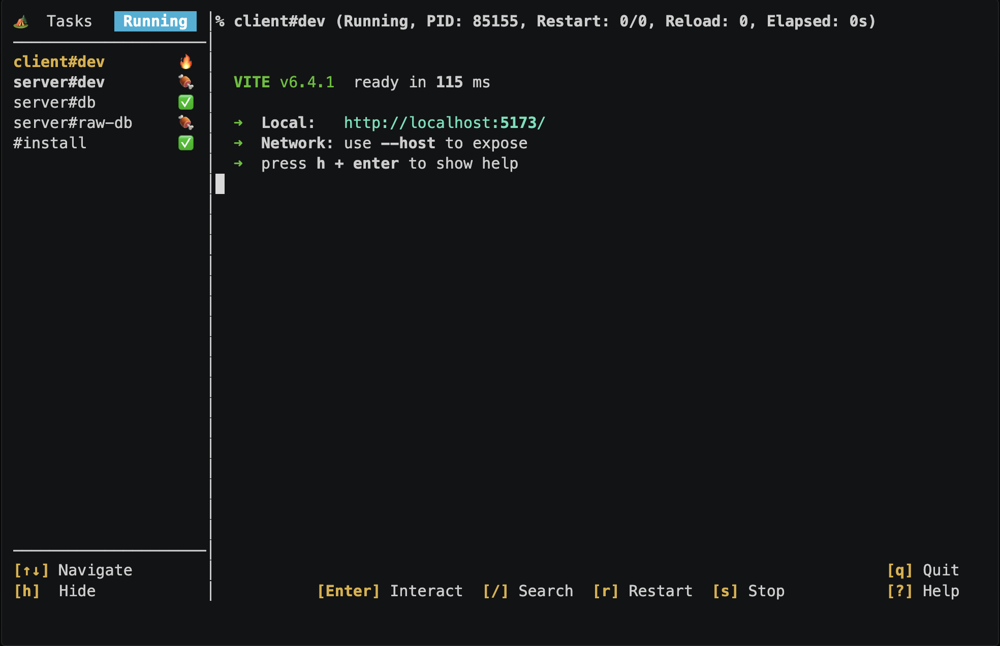
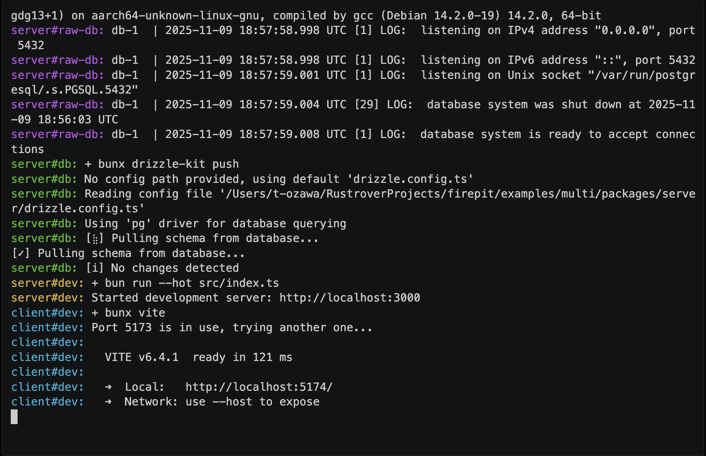

# TUI

Firepit provides a TUI (Terminal User Interface) to monitor and interact with running tasks and services.

## Task Status

The sidebar on the left displays a list of running tasks and their statuses.
The highlighted task is the currently selected task whose logs are shown in the main view.
Task statuses are indicated by the following icons:

| Icon | Name       | Detail                                                  |
| ---- | ---------- | ------------------------------------------------------- |
| 🪵   | Planned    | The task is waiting for running                         |
| 🔥   | Running    | The task is currently executing                         |
| ✅   | Success    | The task has completed successfully                     |
| 🍖   | Ready      | The service task is ready to use                        |
| 🥬   | Up to date | The task is already up to date and does not need to run |
| ❌   | Failure    | The task has completed with an error                    |
| 🚫   | Stopped    | The task has been manually stopped                      |
| ⚠️    | Skipped    | The task has been skipped due to failed dependencies    |

## Main View

The main view on the right displays real-time logs of the selected task.
You can scroll through the logs using mouse wheel or keyboard.

### Log Search

To search logs, press `/` to open the search bar. Type the search query and press `Enter`.
The search results are highlighted in the logs, and you can navigate through the results using `n` (next) and `N` (previous) keys.
Press `Esc` to remove the search results.

### Interaction

Some commands require user inputs such as Yes/No. Firepit supports these interactive commands.
You can switch to "Interaction mode" and enter the shell of the currently selected task by pressing the `Enter` key.
At this time, keyboard inputs are sent directly to the task's standard input.
To exit interaction mode, press `Ctrl-Z`.

## TUI vs CUI

TUI is available if tty is detected (in most cases, when you run Firepit in a terminal).
If tty is not detected, such as CI environments, Firepit runs tasks with CUI mode and stream logs directly to stdout.

