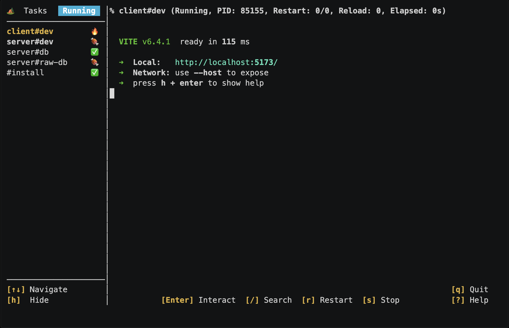
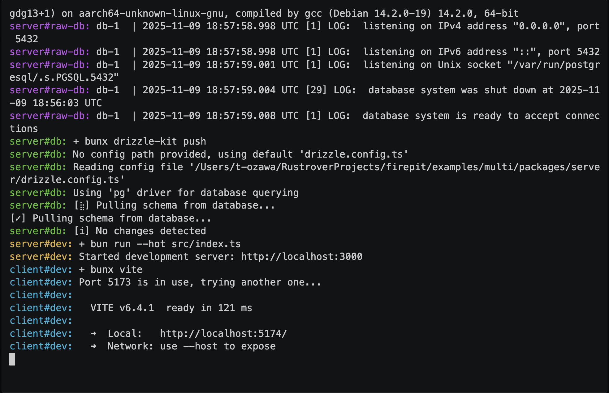

# TUI

Firepit provides a TUI (Terminal User Interface) to monitor and interact with running tasks and services.

## Task Status

The sidebar on the left displays a list of running tasks and their statuses.
The highlighted task is the currently selected task whose logs are shown in the main view.
Task statuses are indicated by the following icons:

| Icon | Name       | Detail                                                                    |
| ---- | ---------- | ------------------------------------------------------------------------- |
| 🪵   | Planned    | The task is waiting for running                                           |
| 🔥   | Running    | The task is currently executing                                           |
| ✅   | Success    | The task has completed successfully                                       |
| 🍖   | Ready      | The service task is ready to use                                          |
| 🥬   | Up to date | The task is still fresh, already up to date and does not need to run      |
| ♻️    | Re-running | The task is re-running because one of its input files has changed         |
| ❌   | Failure    | The task has completed with an error, or the service did not become ready |
| 🚫   | Stopped    | The task has been manually stopped                                        |
| ⚠️    | Skipped    | The task has been skipped due to failed dependencies                      |
| ❗   | Error      | The task could not be run because of an error during execution            |
| ❓   | Unknown    | The task has finished, but its result could not be determined             |

[Finalizer](/configuration#finalizers) tasks show 🪣 and 💧 in place of 🪵 and 🔥, since they put the fire out rather than keep it burning.

## Main View

The main view on the right displays real-time logs of the selected task.
You can scroll through the logs using mouse wheel or keyboard.

### Log Search

To search logs, press `/` to open the search bar. Type the search query and press `Enter`.
The search results are highlighted in the logs, and you can navigate through the results using `n` (next) and `N` (previous) keys.
Press `?` instead of `/` to search backward, towards the top of the log. `n` then walks up the log and `N` walks down.
Press `Esc` to remove the search results.

### Interaction

Some commands require user inputs such as Yes/No. Firepit supports these interactive commands.
You can switch to "Interaction mode" and enter the shell of the currently selected task by pressing the `Enter` key.
At this time, keyboard inputs are sent directly to the task's standard input.
To exit interaction mode, press `Ctrl-Z`.

### The Firepit Log

Firepit's own log is shown along with the tasks, whether or not [`--log-file`](/cli#log-file-log-file) keeps a copy of it.
A record about a task is written into that task's pane, dim, between the lines of output it belongs between, so the two read in the order they happened.
A record about no task in particular — a shortcut that did not work, a signal that was not expected — goes into every pane: the one you are looking at is the one it has to reach, and there is no telling which that is. At the levels that are read by default these are rare enough that saying it more than once costs less than a place of its own to say it.

By default only warnings and errors are logged. [`--log-level`](/cli#log-level-log-level) `info` adds what Firepit is doing to each task, including every try of an [exec health check](/configuration#readiness) with the output of its command, which is the way to see why a service is not becoming ready.

## TUI vs CUI

TUI is available if tty is detected (in most cases, when you run Firepit in a terminal).
If tty is not detected, such as CI environments, Firepit runs tasks with CUI mode and stream logs directly to stdout.

